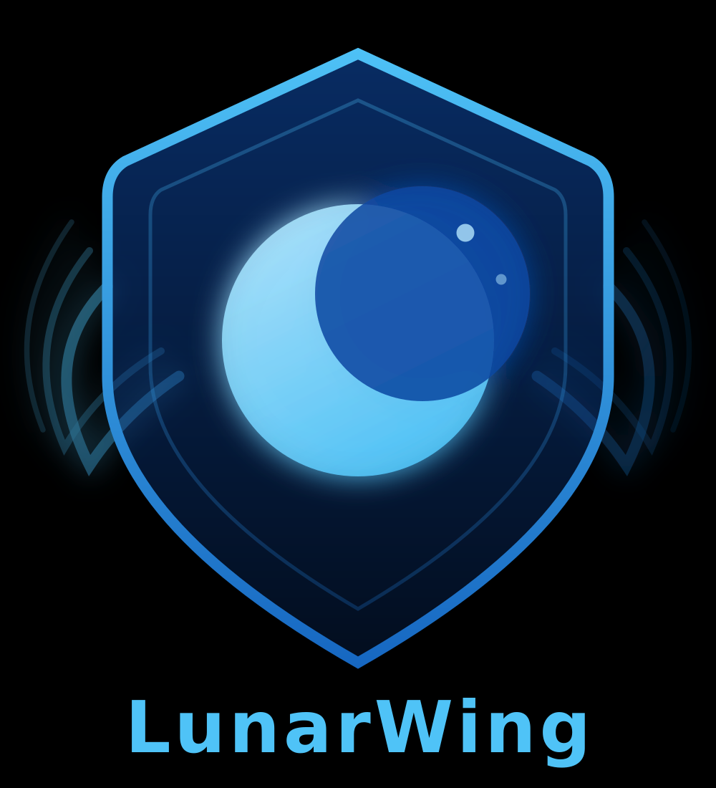

# LunarWing Introduction

## Claws are overrated. So, grow your wings and fly...

### Secure, privacy-focused AI agents you can self-host.

LunarWing is an agentic software framework built in Rust. It connects AI agents to privacy-respecting communication layers — IRC, DarkIRC, XMPP with OMEMO, and more — with real secret management baked in from the start.

It's a hard fork of NearAI's IronClaw, diverging significantly since February 2026. LunarWing is not affiliated with NearAI.

## Why LunarWing

- **Self-hostable end to end** — runs entirely on your own infrastructure, no third-party dependencies required.
- **Privacy-first channels** — DarkIRC, XMPP/OMEMO, and WeeChat relay support out of the box. No Slack, Discord, or Telegram — by design.
- **WASM plugin system** — extend agents with tools and channel adapters compiled to WebAssembly.
- **Built-in secret management** — specialized wrappers for Postgres and LibSQL credential handling.
- **Self-healing infrastructure** — advanced healthchecks and automatic recovery for channel bridges, the daemon itself, and scheduled routines.
- **TensorZero integration** — HTTP proxy with optimized tool_choice routing for local and remote model providers.
- **Lunarpunk values** — AGPLv3 forever. Free software, free infrastructure, no compromises.

<p align="center">
  
</p>

## Quick Links

- Website: [lunarwing.org](https://lunarwing.org)
- Source: [github.com/LunarWingOrg/lunarwing](https://github.com/LunarWingOrg/lunarwing)
- IRC: `#lunarwing` on [irc.libera.chat](https://web.libera.chat/?channel=#lunarwing) (port 6697, TLS)
- License: [AGPL-3.0](https://www.gnu.org/licenses/agpl-3.0.en.html)

[LunarWing](https://lunarwing.org/)

##### End of Introduction
---

# Finer Details

The LunarWing project began in February 2026. Initially a hard fork of the Ironclaw project to support custom tools and channels, the project eventually evolved to introduce deep infrastructural changes over time.

LunarWing is a self-hosted, privacy-first AI agent. The fork prioritizes useful tools, bridges, and channels such as XMPP/OMEMO, Gotify, scheduled routines with fallbacks, systemd deployment, OpenRC, and open-protocol channels. Proprietary service centered channels (Slack, Discord, Telegram) are intentionally unsupported within the monorepo and are gradually being fully removed.

The LunarWing project strictly maintains the AGPLv3 license on the core project and all extensions, tools, and channels. We will use the same license across our other repositories if legally possible.

## Why "LunarWing"?

**Lunar** -- We are firm believers in Lunarpunk.

**Wing** -- Wings are extensions of the body which allow flight. We chose the term `wing` to differentiate ourselves from most open source agentic software which uses the term `claw`. We are not required to remain on the ground.

## Features

LunarWing adds real privacy-respecting tools and channels, with full secret support, right out of the box:

### Channels & Communication
* **XMPP with OMEMO** -- WASM channel, bridge service, and core code changes for full encrypted chat (1:1 and group), with XEP-0363 HTTP file upload support
* **Weechat** -- WASM channel allowing the agent to use Weechat as an IRC/DarkIRC/Signal/XMPP/Slack/Matrix/Rocketchat client
* **Enjin** -- optional weechat plugin to enable E2E for normal IRC
* **DarkIRC** -- DarkIRC WASM channel, p2p e2e protocol from DarkFi

### Tools & Notifications
* **Gotify** -- WASM tool for agent-initiated push notifications
* **Vision Service / OCR Sidecar** -- Standalone Rust service for OCR (Tesseract) and vision-language analysis (Qwen3-VL), with smart routing, PaddleOCR fallback, caching, rate limiting, and metrics (`projects/ocr-sidecar/`)
* **vision-analyze WASM Tool** -- Native WASM tool for image analysis via the Vision Service sidecar (`ic/tools-src/vision-analyze/`)
* **Lunartica** -- Free Open Source Self Hostable Agent Coordination Platform (seperate repo)

### Worker Containers
* **Codex Worker** -- Persistent OpenAI Codex worker container with optional ACP bridge support and persistent mounted storage (`codex4lunarwing/`)
* **Nanocode Worker** -- Persistent NanoGPT community Nanocode worker container with optional ACP bridge, git/ssh key support, persistent storage, and development tools (`lunarcode4lunarwing/`)
* **Pebble Worker** -- Persistent Rust-based Pebble agentic coding harness worker with NDJSON event streaming and health endpoints (`pebble4lunarwing/`)
* **Re worked Built-in Worker - Debloated** -- Native worker running inside the LunarWing daemon getting debloated, rip out obselete worker modes in favor of specialized worker container support (`ic/src/worker/`)
* **Re worked Sandbox Worker - Debloated** -- Docker-isolated execution sandbox, debloated (`ic/src/sandbox/`)

### Infrastructure & Operations
* Specialized secret management wrapper scripts for both PostgreSQL and libSQL
* Optional systemd, launchd, and OpenRC services for LunarWing, channel bridges, and healthcheck services
* Improved scheduling system with native retry and exponential backoff for transient failures, stuck-run recovery, configurable lightweight execution timeouts, and automatic sweeping of orphaned routine runs
* Self-healing healthchecks for channel bridge services, the daemon, and the routines system. Infrastructure health checks auto-detect init system (systemd, OpenRC, launchd)
* Production multi-tenant deployment via `scripts/lunarwing-mt-admin.sh` with per-user OS isolation, port registry, and support for systemd, macOS (launchd), and OpenRC
* TensorZero HTTP proxy support for model routing, function-call routing, and training feedback loops
* Support for embedded memory search models
* Reflex compiler for LLM-free fast-path execution of recurring prompts with exact, fuzzy (Jaro-Winkler), and semantic matching, auto-promotion, and stale pattern eviction
* Supervised mode (`--supervised`) for human-gated tool execution — all tool actions require explicit approval regardless of tier
* Response suppression and future cancellation with soft timeout and secondary hard-kill mechanism

### Development & Testing
* Automated test suite with trace-replay E2E testing (no real LLM required)
* Worker test harness for all 4+ worker types with Docker Compose isolation (`tests/`)
* REPLv2 server and client with better output formatting and subagent support, backout and approval support included
* Support for external agentic coding tools via external worker mode
* Cross-platform test harness (`lunarwing-xmpp-test-env.sh`) with launchd (macOS), systemd (Linux), and OpenRC support as well as a production-grade developer testing suite

### Philosophy

LunarWing developers care about your freedom as a user. We do not support proprietary platforms in our official repository. All WASM tools and channels that developers wish to create for proprietary platforms can be maintained elsewhere. We focus on self-hostable communication layers and open protocols.

The LunarWing core development team is not affiliated with NearAI.

Our core team uses a self-hosted Vikunja kanban board to track tasks. Additionally, we use our own LunarWing agents to keep track of project progress.

#### As of now, we are entirely self-funded and work on this project on a voluntary basis. No VCs, Corporate Overlords, or sponserships/grants. This will be updated in the future if it changes.

## Instance Setup

LunarWing supports a preseeded instance layout for fresh installs. This means that your agents can have any identity and any pre-seeded memories before you even interact with them for the first time if you wish. 

## Examples: 

### PostgreSQL

```bash
ic/scripts/setup-instance.sh \
  --base-dir /srv/lunarwing \
  --database postgres \
  --database-url 'postgres://user:pass@db:5432/lunarwing' \
  --llm-api-key unneeded \
  --run-onboard
```

### libSQL

```bash
ic/scripts/setup-instance.sh \
  --base-dir /srv/lunarwing-dev \
  --database libsql \
  --libsql-path /srv/lunarwing-dev/lunarwing.db \
  --run-onboard
```

### With Preseeded Secrets

```bash
ic/scripts/setup-instance.sh \
  --base-dir /srv/lunarwing-secure \
  --database postgres \
  --database-url 'postgres://user:pass@db:5432/lunarwing' \
  --agent-name lunarwing \
  --gateway-token 'replace-me-gateway-token' \
  --secrets-master-key '0123456789abcdef0123456789abcdef0123456789abcdef0123456789abcdef' \
  --llm-api-key unneeded \
  --run-onboard
```

Setup writes:
- `$LUNARWING_BASE_DIR/config.toml`
- `$LUNARWING_BASE_DIR/.env`
- `$LUNARWING_BASE_DIR/workspace-template/*.md`

Preferred env var: `LUNARWING_BASE_DIR` (legacy alias `IRONCLAW_BASE_DIR` still accepted).

### Setup Options

| Flag | Effect |
|------|--------|
| `--agent-name` | Writes `[agent].name` to `config.toml` |
| `--gateway-token` | Writes `GATEWAY_AUTH_TOKEN` to `.env` |
| `--secrets-master-key` | Writes `SECRETS_MASTER_KEY` to `.env` (64-char hex) |

`SECRETS_MASTER_KEY` enables the encrypted secrets store without depending on the OS keychain. On Linux, `lunarwing onboard --quick` generates and persists this value automatically when it is missing. macOS prefers keychain storage by default.

### Config Defaults

```
llm_backend = "openai_compatible"
openai_compatible_base_url = "http://127.0.0.1:3002"
selected_model = "tensorzero::function_name::lunarwing"
agent.name = "lunarwing"
```

Seed files:
- Runtime config template: [ic/deploy/config.toml](ic/deploy/config.toml)
- Persona and memory seeds: [ic/deploy/workspace-template/](ic/deploy/workspace-template/)

At runtime, workspace files are imported from `$LUNARWING_BASE_DIR/workspace-template/` before generic built-in seeds, so files such as `SOUL.md`, `IDENTITY.md`, `BOOTSTRAP.md`, `TOOLS.md`, and `USER.md` can be customized per instance.

## Running Locally

```bash
cd ic
LUNARWING_BASE_DIR=/path/to/instance ./run.sh
```

`run.sh` defaults `AGENT_NAME=lunarwing` and passes through any explicit `AGENT_NAME`, `LUNARWING_BASE_DIR`, or legacy `IRONCLAW_BASE_DIR` you export. It does not inject LLM URL or model defaults, so fresh instances use `config.toml` unless you override with env vars.

## Testing

### Rust Unit & Integration Tests

```bash
cd ic
cargo test                          # unit tests
cargo test --features integration   # + PostgreSQL tests
cargo test test_name -- --nocapture # single test with output
```

### E2E Tests (Python/Playwright)

Browser-based E2E tests against a live instance with a mock LLM. See [ic/tests/e2e/CLAUDE.md](ic/tests/e2e/CLAUDE.md).

```bash
cd ic/tests/e2e
python -m venv .venv && source .venv/bin/activate
pip install -e .
playwright install chromium
pytest scenarios/
```

### Worker Test Harness

Matrix test suite for all 4 worker types (Codex, Nanocode, Built-in, Sandbox) running in Docker Compose isolation. Validates health endpoints, WebSocket protocol, error handling, and resource cleanup.

```bash
cd tests
pip install -r requirements.txt
python runner.py --mode smoke     # happy paths only (CI)
python runner.py --mode full      # + chaos scenarios (nightly)
python runner.py --worker codex   # single worker type
```

See [tests/README.md](tests/README.md) for the full test matrix and mock service architecture.

### Integration Test Harness

`ic/scripts/lunarwing-xmpp-test-env.sh` is the full-stack test harness for PostgreSQL, TensorZero proxy, XMPP bridge, WASM artifacts, and the daemon. Works on Linux and macOS.

- Single-tenant quick start: see [docs/ops/HARNESS-SINGLE-TENANT.md](docs/ops/HARNESS-SINGLE-TENANT.md)
- Multi-tenant quick start: see [docs/ops/MULTITENANCY-HARNESS.md](docs/ops/MULTITENANCY-HARNESS.md)
- Full single-tenant reference: [ic/testing/lunarwing-xmpp/README.md](ic/testing/lunarwing-xmpp/README.md)

## Watchdog Scheduler

```bash
sudo ic/scripts/install-lunarwing-watchdog.sh
```

Behavior depends on the detected service manager:

- **systemd**: installs `lunarwing-watchdog.service` + `lunarwing-watchdog.timer`
- **OpenRC**: installs `lunarwing-watchdog-openrc` + either an hourly hook or a managed root `fcrontab` entry

The OpenRC default is intentionally conservative:
- If `cronie`, `crond`, or `dcron` is already present, the installer keeps the cron-hourly path
- If no cron daemon is present but `fcron` is available, the installer uses `fcron` automatically

Force a specific OpenRC mode:

```bash
sudo LUNARWING_WATCHDOG_SCHEDULER=fcron ic/scripts/install-lunarwing-watchdog.sh
sudo LUNARWING_WATCHDOG_SCHEDULER=hourly ic/scripts/install-lunarwing-watchdog.sh
```

Use `LUNARWING_WATCHDOG_CRON_DIR=/path/to/hourly-dir` for nonstandard directory layouts.

## Fresh Recreate Recipes

### PostgreSQL + XMPP + systemd

See the documented recipe in [ic/testing/lunarwing-xmpp/README.md](ic/testing/lunarwing-xmpp/README.md).

### libSQL with Custom Gateway Token

```bash
cd ic

export BASE=/tmp/lunarwing-libsql
export GATEWAY_TOKEN='replace-me-gateway-token'
export LLM_API_KEY='unneeded'

rm -rf "$BASE"

scripts/setup-instance.sh \
  --base-dir "$BASE" \
  --database libsql \
  --libsql-path "$BASE/lunarwing.db" \
  --llm-base-url http://127.0.0.1:3002/openai/v1 \
  --llm-model tensorzero::function_name::lunarwing \
  --llm-api-key "$LLM_API_KEY" \
  --agent-name lunarwing \
  --run-onboard

python3 - <<'PY'
import os
from pathlib import Path

path = Path(os.environ["BASE"]) / ".env"
values = {
    "LUNARWING_BASE_DIR": os.environ["BASE"],
    "GATEWAY_ENABLED": "true",
    "GATEWAY_HOST": "127.0.0.1",
    "GATEWAY_PORT": "8765",
    "GATEWAY_AUTH_TOKEN": os.environ["GATEWAY_TOKEN"],
}

lines = path.read_text().splitlines()
seen = set()
out = []
for line in lines:
    if "=" in line and not line.lstrip().startswith("#"):
        key, _ = line.split("=", 1)
        if key in values:
            out.append(f"{key}={values[key]}")
            seen.add(key)
            continue
    out.append(line)
for key, value in values.items():
    if key not in seen:
        out.append(f"{key}={value}")
path.write_text("\n".join(out) + "\n")
PY

LUNARWING_BASE_DIR="$BASE" ./target/debug/lunarwing run
```

## Further Reading

- Architecture docs: see [docs/](docs/)
- Vision service: see [projects/ocr-sidecar/README.md](projects/ocr-sidecar/README.md)
- Testing guide: see [docs/guides/TESTING_GUIDE.md](docs/guides/TESTING_GUIDE.md)
- Release notes: see [docs/releases/](docs/releases/)
- REPLv2 server and client: see [docs/internal/REPLv2_Client_and_Server.md](docs/internal/REPLv2_Client_and_Server.md)

## Community

### Interested in development or otherwise general discussion of LunarWing?

#### See: COMMUNITY.md for more information
